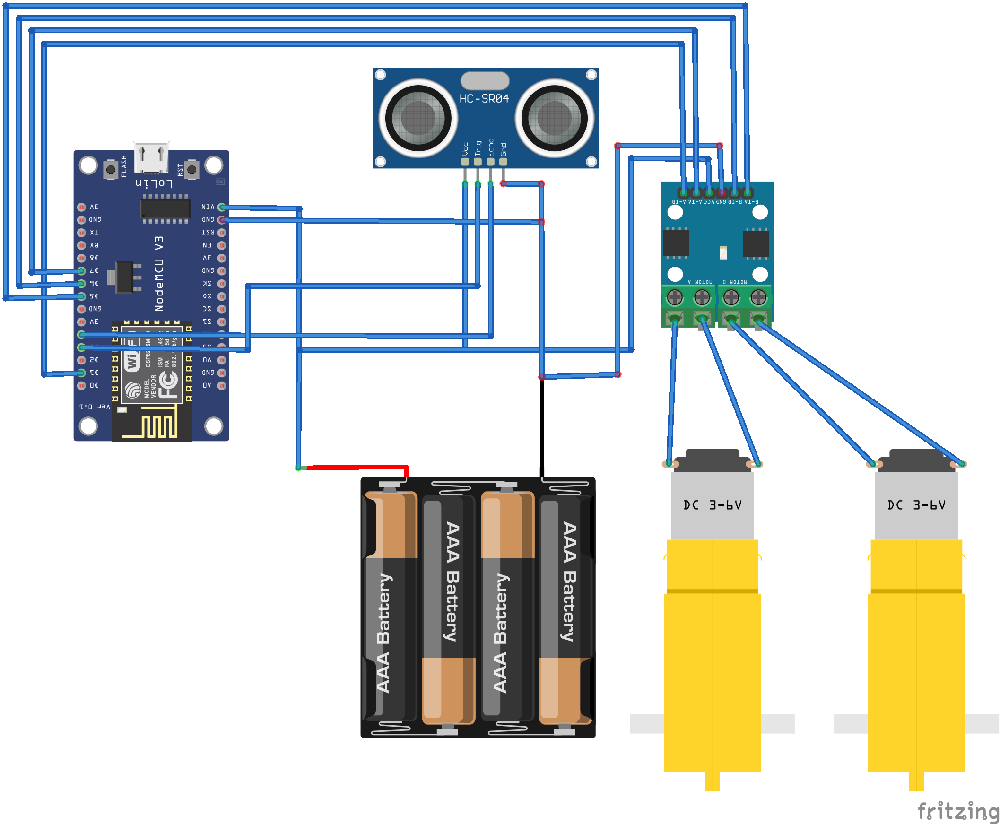

# gendev.bot.esp8266 Arduino IDE code
Code to flash on the NodeMCU compatible ESP8266.

Requires to install ESP8266 boards in Arduino IDE.
* Select `Tools > Board: ... > Boards manager` type `esp8266` and click `install`

Requires the following libraries.
* Select `Tools > Library Manager` and then find these libraries.
  * NewPing by Tim Eckel for ultra-sonic sensor (USS) https://playground.arduino.cc/Code/NewPing/
  * ArduinoJson by Benoit Blanchon for parsing JSON responses https://arduinojson.org
  * WifiManager by tzapu/tablatronix (a bit far down the list) https://github.com/tzapu/WiFiManager

## Functionality
* configures WiFi AP via HTTP
* reads distance using an USS
* sends a HTTP GET request http://host:8080/robot?distance=123
* reads JSON response with fields
  * rightM in {FWD, STP, BWD}
  * leftM in {FWD, STP, BWD}
* powers two or four motors via H-bridge

## Hardware
The links below are [Amazon.co.uk Associate](https://affiliate-program.amazon.co.uk) links. You can use [Amazon Prime Student](https://www.amazon.co.uk/gp/student/signup/info?tag=ringert-21) (free for the first 6 months) to get free one-day shipping.

* [Car with two motors and battery pack](https://amzn.to/3caJQyW) ca. 12GBP
* [ESP8266 as the main controller](https://amzn.to/3v7EAor) ca. 6GBP 
  * or buy 5 of them for 18GBP [5 x ESP8266](https://amzn.to/3emhXGN)
* [Cables with connectors](https://amzn.to/3rInr2J) ca. 7GBP
  * or buy any cheap cable if you are happy do to more soldering
* [L9110S H-bridge to drive motors](https://amzn.to/30t5zge) ca. 5GBP
  * or buy 6 of them for 8GBP [6 x L9110S H-bridge](https://amzn.to/3qvHqQG) (you only need one)
* [HC-SR04 Ultrasonic distance sensor](https://amzn.to/2PNbPNH) ca. 7GBP
  * or buy 5 of them for 10GBP [5 x HC-SR04 sensor](https://amzn.to/3ejJSqZ) (you only need one)
* [AA Batteries](https://amzn.to/38FKIuH) ca. 8GBP (you need 4 to 6)

You can also buy a kit and even save money, e.g., this [Arduino UNO robot](https://amzn.to/3rxuCdJ) for only 33GBP. The problem is that it doesn't have WiFi, but it should be easy to replace the Arduino UNO with an ESP8266 (see list above).

The materials can be bought much cheaper on [Aliexpress](https://aliexpress.com)  if you are willing to wait that long (shipping can take anywhere from a week to a month). You might 20 GBP instead of 40 GBP.

## Build instructions

A [video of how to connect things](https://youtu.be/WTPfQyEEh8c) is avaiable.

The connections to PINs are documented in the code and shown here. Fritzing files are available in folder docs.

# Hardware Extensions
An easy way to extend the robot is by adding more sesor and additional motors. The ESP8266 should still have a few free pins for that.

Another extension is to put a Raspberry Pi with a camera on the robot to have much more processing power onboard. In this case you can either try to replace the ESP8266 or simply connect it to the Raspberry Pi via WiFi (as in the above setting) or even USB. The Raspberry Pis are much cheaper on [The Pi Hut](https://thepihut.com/) than on Amazon:
* a [Raspberry Pi zero with WiFi](https://thepihut.com/products/raspberry-pi-zero-w) ca. 10GBP, or 
* a [Raspberry Pi 4B](https://thepihut.com/products/raspberry-pi-4-model-b?variant=20064052674622) between 34GBP (2GB RAM) and 74GBP (8GB RAM)
* there are tons of extensions with [cameras](https://thepihut.com/pages/search-results?q=camera&narrow=%5B%5B%22Categories%22%2C%2226561196%22%5D%2C%5B%22Vendor%22%2C%22The%20Pi%20Hut%22%5D%5D&sort_by=relevency&disable_semantics=1) etc.

