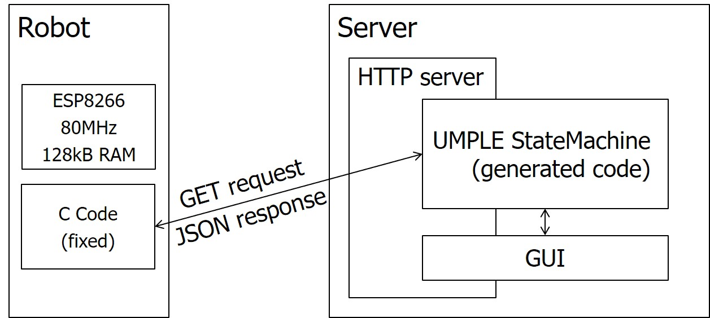

# Eclipse project gendev.bot.runner
Project for executing some engine for generated code and making it available for the robot to connect to via HTTP.

Currently supported engines:
* UMPLE StateMaching code (examples included)
* Spectra synthesized controllers
* AspectJ aspects decorating a Java implementation

## Project contents
* UMPLE StateMachines are in the root of folder src (to generate code from Eclipse)
* Spectra specifications are in the root folder (synthesize controllers from these)
* AspectJ aspects are in in package `gendev.bot.runner.aspectj`

## Plug-Ins
* UMPLE code generation requires the UMPLE plug-in available from `http://cruise.umple.org/org.cruise.umple.eclipse.plugin.update.site`
* Spectra synthesis requires the Spectra Tools plug-in available from `http://smlab.cs.tau.ac.il/syntech/spectra/tools/update/`
* AspectJ ideally via the Eclipse Marketplace or see `https://www.eclipse.org/ajdt/`